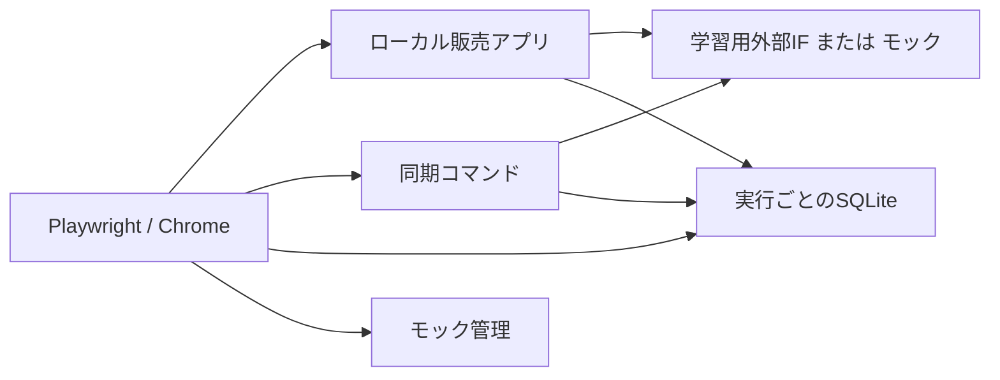

# 構成図

```mermaid
flowchart LR
 T[Playwright / Chrome] --> A[ローカル販売アプリ]
 T --> B[同期コマンド]
 B --> U[学習用外部IF または モック]
 A --> U
 A --> D[実行ごとのSQLite]
 B --> D
 T --> D
 T --> M[モック管理]
```

学習用外部IFにも実HTTP接続する。モックは同じデータ形式と障害応答を提供する。SQLiteは専用ローカルで、実MySQLやAWSの代用として合格を主張しない。実SSOの認証は人がChromeで行い、ローカル認証状態はGit外に保存する。Kubernetesアダプターの実クラスタ接続は別途未確認。
