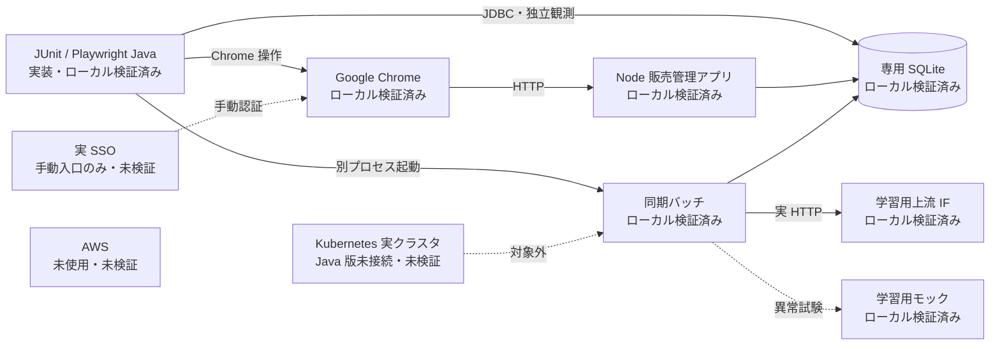

# Java 版の構成と検証範囲

```mermaid
flowchart LR
  J[JUnit / Playwright Java<br/>実装・ローカル検証済み] -->|Chrome 操作| C[Google Chrome<br/>ローカル検証済み]
  C -->|HTTP| A[Node 販売管理アプリ<br/>ローカル検証済み]
  J -->|JDBC・独立観測| DB[(専用 SQLite<br/>ローカル検証済み)]
  A --> DB
  J -->|別プロセス起動| B[同期バッチ<br/>ローカル検証済み]
  B -->|実 HTTP| U[学習用上流 IF<br/>ローカル検証済み]
  B -. 異常試験 .-> M[学習用モック<br/>ローカル検証済み]
  B --> DB
  K[Kubernetes 実クラスタ<br/>Java 版未接続・未検証] -. 対象外 .-> B
  S[実 SSO<br/>手動入口のみ・未検証] -. 手動認証 .-> C
  W[AWS<br/>未使用・未検証]
```

学習用上流 IF との実 HTTP と本番外部サービスの接続検証は異なります。各試験の専用 DB とプロセスは終了時に回収し、停止確認できなければ復旧用に残します。ケース5の観測は [同期観測コード](src/test/java/learning/SyncObservation.java) を参照してください。
